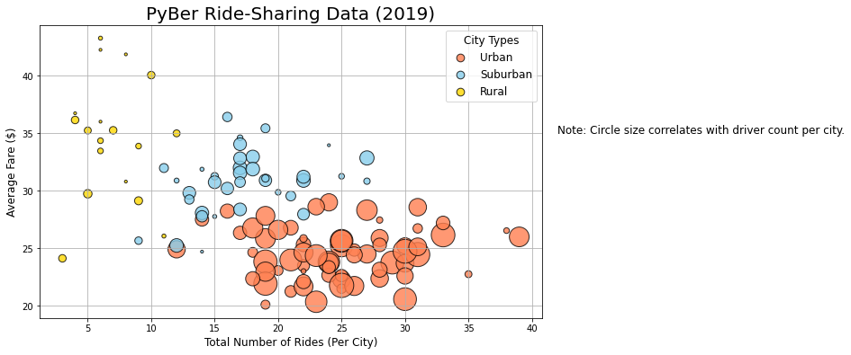
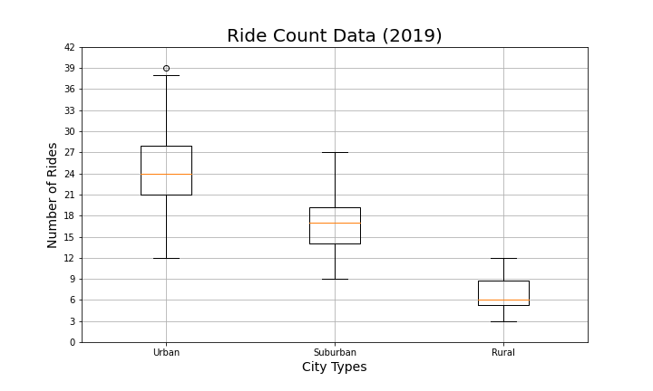
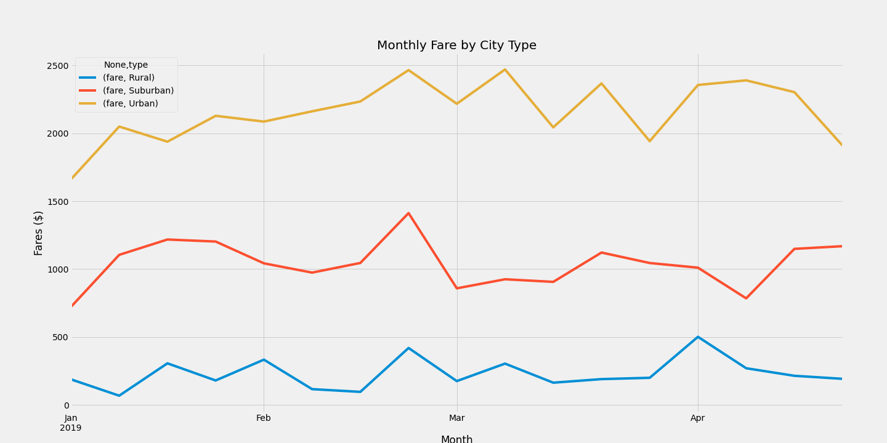

# pyber-analysis
Analyzing and visualizing rideshare data via matplotlib

## Overview
An analysis of ride-share data to uncover trends regarding city type, particularly fare rates. 

## Resources
Matplotlib 3.5.1
Python 3.7.11

## Results
### Number of Rides per City by Average Fare
#### Rural
- Rural cities accounted for the fewest rides and the most expensive fares.
- Rural cities accounted for the fewest drivers. 
#### Suburban
- Suburban cities accounted for both the middle count and middle expense of rides. 
- Suburban cities accounted for the mid count of drivers. 
#### Urban
- Urban cities accounted for the greatest count of rides with the least expensive fares.
- Urban cities account for the greatest count of drivers. 

### Number of Rides by City Type
- Rural cities accounted for the fewest number of rides (median = 6). 
- Suburban cities accounted for the middle number of rides (median = 17). 
- Urban cities accounted for the greatest number of rides (median = 24).

### % of Total Fares by City Type
- Rural cities accounted for the smallest portion of total fares (6.8%). 
- Suburban cities accounted for the mid portion of total fares (30.5%). 
- Urban cities accounted for the largest portion of total fares (62.7%). 
- Urban cities accounted for a larger portion of total fares than rural and suburban cities combined. 

### % of Total Rides by City Type
- Rural cities accounted for the smallest portion of total rides (5.3%).
- Suburban cities accounted for the mid portion of total rides (26.3%). 
- Urban cities accounted for the largest portion of total rides (68.4%). 
- Urban cities accounted for a larger portion of total rides than rural and suburban cities combined. 

### % of Total Drivers by City Type
- Rural cities accounted for the fewest number of drivers (2.6%). 
- Suburban cities accounted for the mid count of drivers (16.5%). 
- Urban cities accounted for the greatest number of drivers (80.9%). 

### Sum of Monthly Fares by City Type
- Overall, market sales appear relatively stable over the course of the Q1, with the exception of a small dip near the beginning of January. While the reason for the dip cannot be ascertained based on given data, it would be safe to hypothesize the dip is due to the holidays. 
- Rural cities account for the smallest collective sum of sales. 
- Suburban cities account for the middle collective sum of sales. 
- Urban cities account for the largest collective sum of sales. 

## Summary

The first recommendation to be made based on the data would be to decrease prices in rural areas. Introducing surge pricing in urban areas might provide enough revenue to cover the costs in rural areas for the time being.   
The second recommendation to be made would be to increase the number of drivers in the area. Introducing heightened rates of pay might be enough to entice more people to sign up as drivers.   
The third recommendation to be made would be to increase advertising in rural areas, specifically targeting rural needs. Both internet and traditional media would be recommended, given rural culture, with more attention being given to traditional means of advertisement (ex: radio, billboard, newspapers, local tv stations).    

It should be noted that significant further investigation and data collection NEEDS to be performed in order to ascertain the true reasons behind WHY rural populations are not taking advantage of the rideshare services. 
The data provided only reflects the actions of these populations, and not their reasoning. Potential issues that could be preventing rural usage include: 
- Longer distances in rural areas might be driving up ride costs. The average length at which a ride becomes prohibitively expensive should be determined. 
- Brand recognition and trust need to be evaluated. Rural areas have a history of being slow to change, and as a result, more work may need to be invested into developing brand recognition in rural areas. 
- Rideshare accessibility needs to be determined. Many people in rural areas do not have smartphones, and as a result, may not be able to access the company's app. Investigation needs to be performed to determine the rate of smartphone users against the nation's average. 
- Most importantly, analysis on population ratios has not been performed thus far. In order to determine maximum market saturation in rural areas, the proportions of rural populations against total populations needs to be compared to rural rideshare marketshare against total marketshare. The area is potentially at saturation, and any further attempts at increasing sales in the area could be pointless if the ratios already match. 

