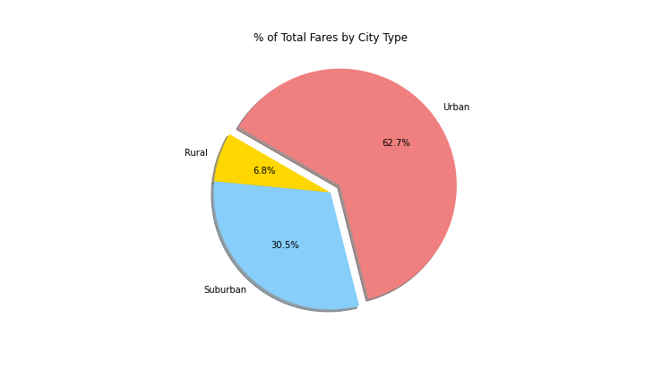
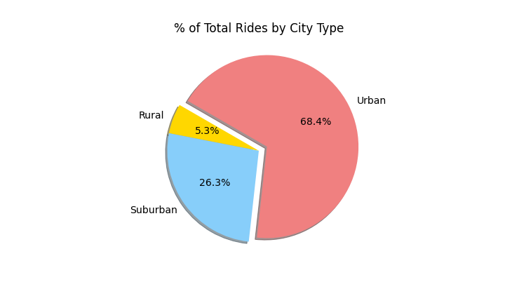

# pyber-analysis
Analyzing and visualizing rideshare data via matplotlib

## Overview
An analysis of ride-share data to uncover trends regarding city type, particularly fare rates. 

## Resources
Matplotlib 3.5.1
Python 3.7.11

## Results
### Number of Rides per City by Average Fare
#### Rural
- Rural cities accounted for the fewest rides and the most expensive fares.
- Rural cities accounted for the fewest drivers. 
#### Suburban
- Suburban cities accounted for both the middle count and middle expense of rides. 
- Suburban cities accounted for the mid count of drivers. 
#### Urban
- Urban cities accounted for the greatest count of rides with the least expensive fares.
- Urban cities account for the greatest count of drivers. 

### Number of Rides by City Type
- Rural cities accounted for the fewest number of rides (median = 6). 
- Suburban cities accounted for the middle number of rides (median = 17). 
- Urban cities accounted for the greatest number of rides (median = 24).

### % of Total Fares by City Type
- Rural cities accounted for the smallest portion of total fares (6.8%). 
- Suburban cities accounted for the mid portion of total fares (30.5%). 
- Urban cities accounted for the largest portion of total fares (62.7%). 
- Urban cities accounted for a larger portion of total fares than rural and suburban cities combined. 

### % of Total Rides by City Type
- Rural cities accounted for the smallest portion of total rides (5.3%).
- Suburban cities accounted for the mid portion of total rides (26.3%). 
- Urban cities accounted for the largest portion of total rides (68.4%). 
- Urban cities accounted for a larger portion of total rides than rural and suburban cities combined. 

### % of Total Drivers by City Type
- Rural cities accounted for the fewest number of drivers (2.6%). 
- Suburban cities accounted for the mid count of drivers (16.5%). 
- Urban cities accounted for the greatest number of drivers (80.9%). 

### Sum of Monthly Fares by City Type

## Summary

In order to address the disparities in ridesharing between city type, further investigation into the reasons for the disparity NEEDS to be performed.   
It should be noted that further analysis should also be performed to determine differences in rideshare proportion against population data to determine if the percent of rural marketshare reflects percent of rural population. 
If the proportion of rural marketshare matches the population percentage, then it's likely that the product has already reached market saturation in those areas, and business likely will not be able to increase. 
If the proportions do not match, then further investigation should be done to determine the reasons for the disparity. 
Even though rural areas have a smaller population, the population there does often need to travel longer distances than the average urban customer. 
These areas are also signigicantly less likely to adjust to new things quickly, and ridesharing likely falls under that category.   
As evidenced above, ridesharing is significantly more expensive than it is in both urban and suburban cities. 
Given the data analyzed, the strongest recommendation that can be made to increase rides in the area and help rural populations adapt to a new form of transportation would be to significantly decrease the price of rides in the area. 
Even if the price decrease is only temporary, it might be enough to sway the population into trusting the service. 
Once trust has been established, and the rural populations have adjusted to ridesharing, heightened prices can be re-established. 

